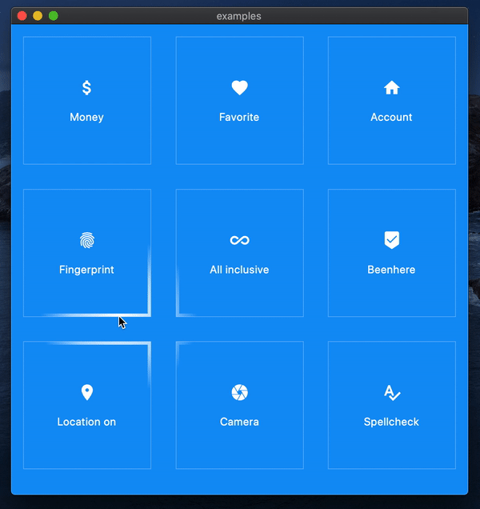

# global_gradient

A Flutter package for creating visual effects with globally positioned gradients.

[Live Demo on Web platform](https://blaugold.github.io/global_gradient/)

## Usage

[spotlight_border_demo.dart](https://github.com/blaugold/global_gradient/blob/master/examples/lib/spotlight_border_demo.dart)
shows how this package can be used to create a spotlight effect at box borders.
